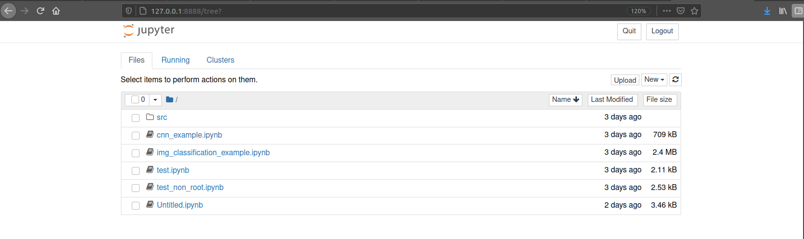
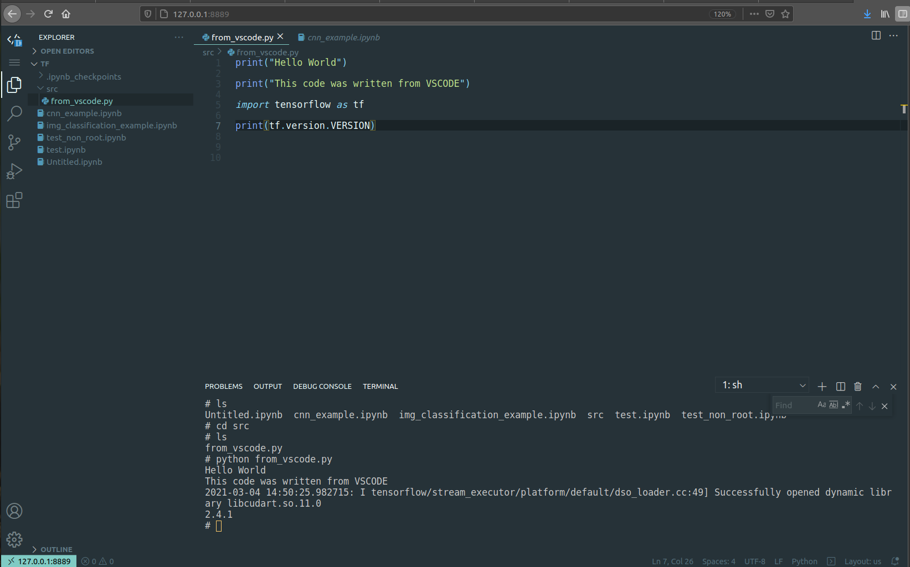

ZeroTF Docker Stack
===============

This repository provides a docker container for easier development in machine learning and deep learning. It supports TensorFlow with GPU enabled, Jupyter Notebook, and Code Server (VSC on the browser). You can add any python library in requirements.txt, and configure the jupyter-notebook token in the .env file.

 
## Getting Started

Make sure you have installed the docker engine and docker-compose. If not you can refer to the [docker installation guide](https://docs.docker.com/engine/install/) and [docker-compose installation guid](https://docs.docker.com/compose/install/)

## Install NVIDIA Docker support

Make sure you have installed the NVIDIA driver and Docker engine for your Linux distribution Note that you do not need to install the CUDA Toolkit on the host system, but the NVIDIA driver needs to be installed.

For instructions on getting started with the NVIDIA Container Toolkit, refer to the [installation guide](https://docs.nvidia.com/datacenter/cloud-native/container-toolkit/install-guide.html#docker).

## Install the Stack
The installation is very simple.
```bash
$ git clone https://github.com/noczero/ZeroTF-Docker-Stack.git ZeroTF
$ cd ZeroTF
$ docker-compose up --build -d
```

## Usage
If nothing error, then you can open [127.0.0.1:8888](http://127.0.0.1:8888) with your browser, then type zeroml as the default token.



For code-server is available on [127.0.0.1:8889](http://127.0.0.1:8888). Open folder /tf for the working directory. You can open its terminal and access the container bash shell. You can run a python file or something else. You can install an extension and customize it, like Visual Studio Code. FYI, a jupyter-notebook file is not yet supported.

 

All files including notebooks or any python file are stored in the code directory. 

The container won't stop unless you stop it, using 
``` 
$ docker stop 'container-id' 
```


